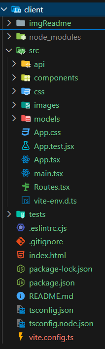
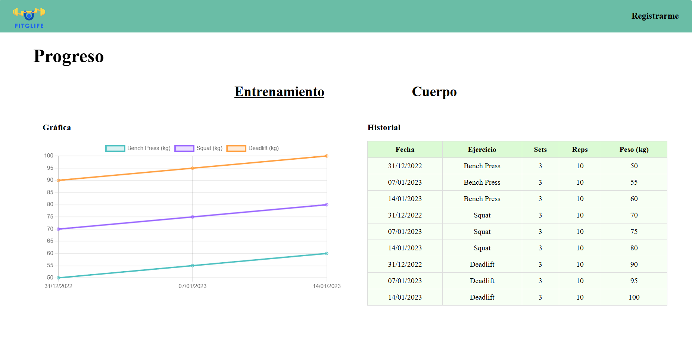
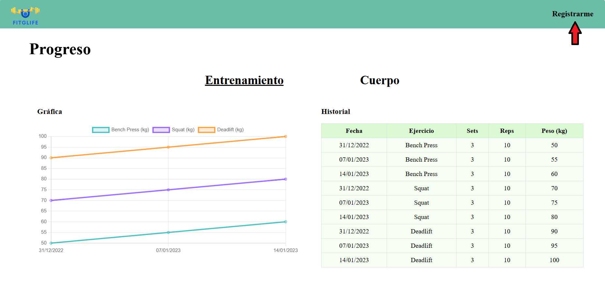
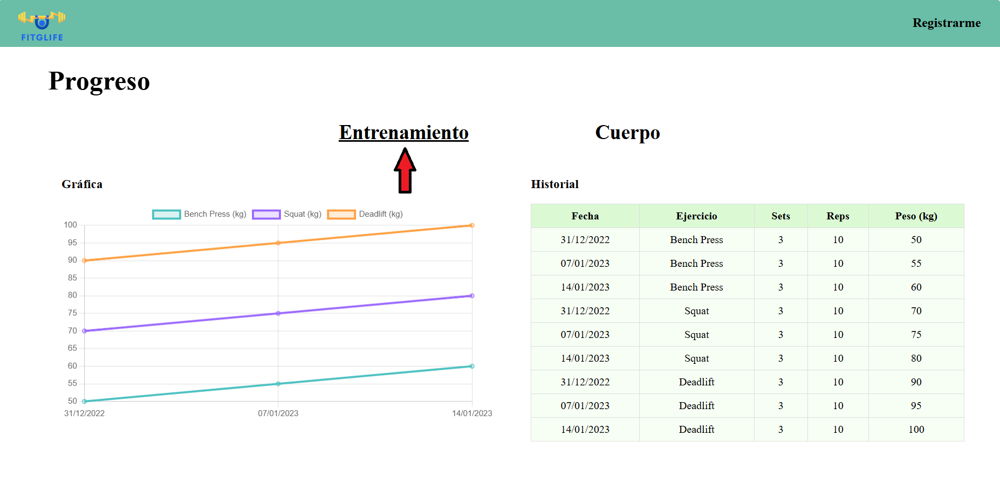
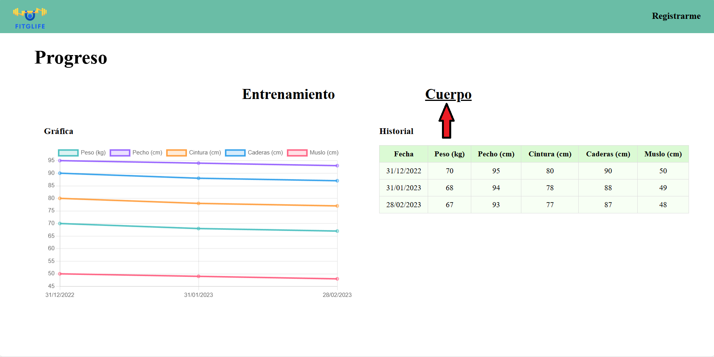
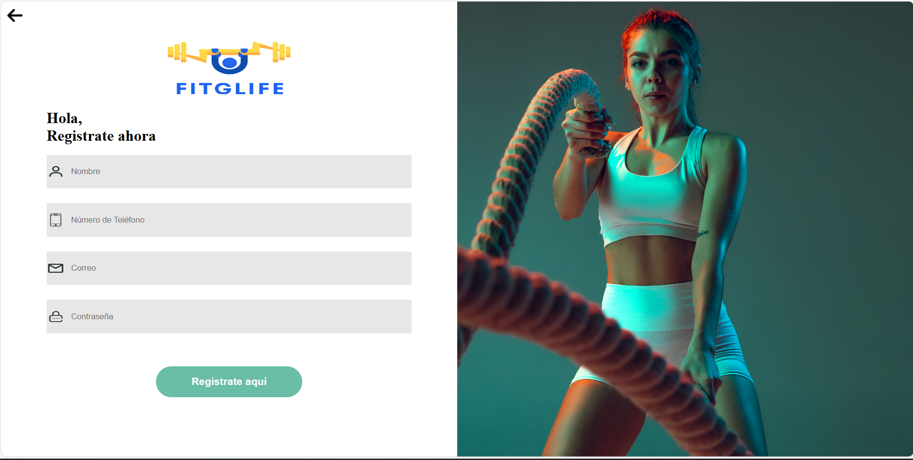
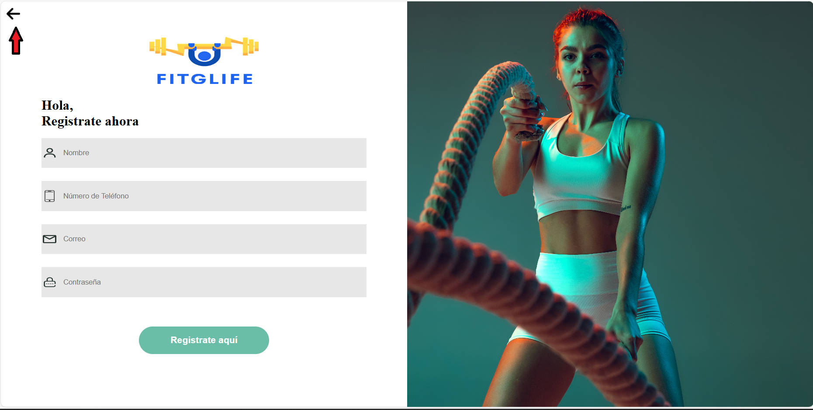
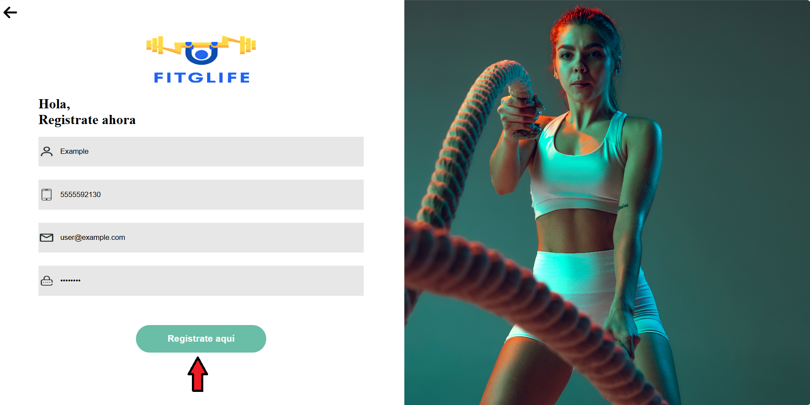
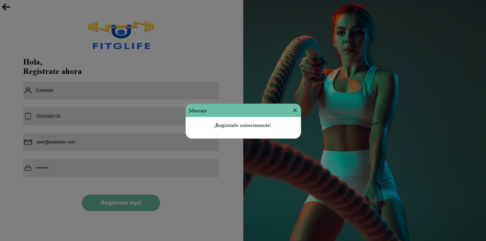
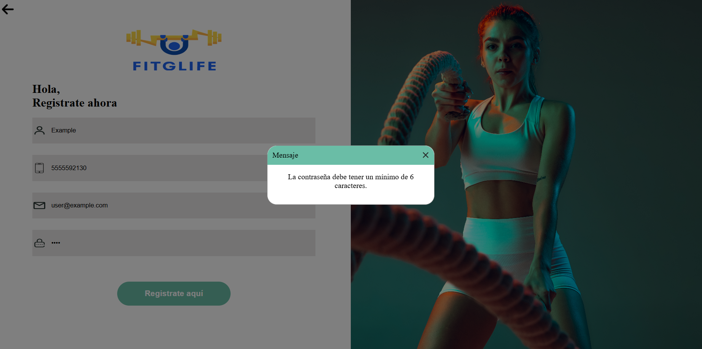

## Instrucciones de Instalación y Ejecución del Proyecto

Para instalar y ejecutar el proyecto, sigue estos pasos:

1. **Clonar el repositorio:** Clona el repositorio del proyecto desde GitHub utilizando el siguiente comando en tu terminal:

    ```bash
    git clone <url_del_repositorio>
    ```
    Reemplaza <url_del_repositorio> con la URL real del repositorio.

2. **Instalar dependencias**: Ve al directorio del proyecto clonado y navega hasta el directorio client, donde se encuentra el código fuente del cliente de la aplicación. Luego, ejecuta el siguiente comando para instalar todas las dependencias necesarias:
    ```bash
    cd Fitglifeweb/client
        npm install
    ```
 3. **Ejecutar la aplicación**: Una vez que hayas instalado todas las dependencias, puedes ejecutar la aplicación utilizando el siguiente comando:
    ```bash
    npm run dev
    ```
## Descripción del Proyecto
El proyecto consiste en una aplicación web que incluye un Dashboard para el consumo de datos y un formulario para la inserción de datos. Además, se ha configurado la navegación utilizando React Router y se establece la conexión con un servicio web a través de fetch. Por último, se realizan pruebas utilizando React Testing Library para asegurar el correcto funcionamiento de las funcionalidades clave de la aplicación.

### Dashboard para el Consumo de Datos

El Dashboard permite visualizar datos mediante gráficos y se ha desarrollado con un diseño responsivo. Utiliza componentes reutilizables para facilitar la mantenibilidad del código.

### Formulario para Inserción de Datos

El formulario permite la inserción de datos a través de una estructura bien definida. Incluye al menos una validación de algún campo y proporciona indicaciones de éxito o error en la inserción.

### Navegación con React Router

Se ha configurado React Router para manejar la navegación entre las vistas del Dashboard y el Formulario. La URL cambia apropiadamente y se puede navegar directamente a una vista específica.

### Conexión con el Servicio Web

Se utiliza fetch para realizar solicitudes HTTP al servidor, tanto para obtener datos como para enviar datos desde el formulario.

### Pruebas con React Testing Library

Se han realizado pruebas para asegurar que los datos se recuperan y se muestran correctamente en el Dashboard. También se verifica que los datos se envían correctamente al servicio web desde el formulario. Además, se realizan pruebas para asegurar que un componente clave se renderiza correctamente con los datos esperados. Se simulan eventos de usuario, como clics para el envío del formulario, y se verifica el comportamiento resultante.

### Estructura del Proyecto

El proyecto está organizado en la siguiente estructura de directorios:<br/>



- **client:** Contiene el código fuente del cliente de la aplicación.
  - **imgReadme:** Directorio de las imagenes mostradas en el README.md.
  - **img:** Directorio para almacenar imágenes relacionadas con el cliente.
  - **public:** Contiene archivos públicos accesibles desde el cliente, como el archivo `index.html`.
  - **src:** Contiene el código fuente principal del cliente.
    - **api:** Directorio para almacenar archivos relacionados con la comunicación con la API.
    - **components:** Componentes reutilizables de la interfaz de usuario.
    - **css:** Archivos de estilos CSS.
    - **images:** Imágenes utilizadas en la interfaz de usuario.
    - **models:** Definiciones de modelos de datos.
    - **App.css:** Archivo de estilos principal de la aplicación.
    - **App.test.jsx:** Archivo de pruebas para el componente principal de la aplicación.
    - **App.tsx:** Archivo principal de la aplicación React.
    - **main.tsx:** Punto de entrada principal de la aplicación.
    - **Routes.tsx:** Configuración de las rutas de la aplicación.
    - **vite-env.d.ts:** Archivo de definiciones de tipos para Vite.
  - **tests:** Directorio para almacenar archivos de pruebas.
  - **.eslintrc.cjs:** Configuración de ESLint para el proyecto.
  - **.gitignore:** Archivo de configuración de Git para ignorar archivos y directorios.
  - **index.html:** Página HTML principal de la aplicación.
  - **package-lock.json:** Archivo de bloqueo de versiones de las dependencias.
  - **package.json:** Archivo de configuración del proyecto npm.
  - **README.md:** Documentación del proyecto.
  - **tsconfig.json:** Configuración del compilador TypeScript.
  - **tsconfig.node.json:** Configuración específica del compilador TypeScript para entornos Node.js.

- **node_modules:** Directorio que contiene las dependencias del proyecto instaladas mediante npm.

## Prototipos de la Vista y Uso (Manual)

### Vista de la Aplicación Principal (App)

La aplicación principal muestra el progreso del usuario en dos categorías: "Entrenamiento" y "Cuerpo". Permite al usuario cambiar entre estas categorías y ver su progreso correspondiente.

#### Uso:

1. **Navegación:**
   - En la barra de navegación, haz clic en el enlace "Registrarme" para ir a la página de registro.
   
   

2. **Selección de Categoría:**
   - Haz clic en la categoría "Entrenamiento" para ver el progreso relacionado con el entrenamiento.
   
   - Haz clic en la categoría "Cuerpo" para ver el progreso relacionado con el cuerpo.
   

### Vista de Registro (Register)

La vista de registro permite a los usuarios registrarse en la aplicación proporcionando su nombre, número de teléfono, correo electrónico y contraseña. También muestra una imagen de fondo.
<br/>
   
#### Uso:

1. **Navegación:**
   - En la esquina superior izquierda, haz clic en la flecha para regresar a la página principal.
   
   

2. **Formulario de Registro:**
   - Completa los campos requeridos:
     - **Nombre:** Ingresa tu nombre.
     - **Número de Teléfono:** Ingresa tu número de teléfono.
     - **Correo:** Ingresa tu correo electrónico.
     - **Contraseña:** Ingresa una contraseña.
   - 
   - Haz clic en el botón "Registrate aquí" para enviar el formulario.
   
   - Si el registro es exitoso, aparecerá un mensaje de confirmación.
   
   - Si hay algún error durante el registro, se mostrará un mensaje de error.
   


## Pruebas de React con Testing Library

Este repositorio contiene pruebas para las funcionalidades de una aplicación React utilizando la biblioteca Testing Library.

### Requisitos previos
- Node.js instalado en tu máquina
- Clonar este repositorio en tu entorno local

### Ejecutar las pruebas

1. Instala las dependencias del proyecto:

2. Ejecuta las pruebas:

### Descripción de las pruebas

**Archivo de pruebas:** `App.test.jsx`
1. **renderizar el enlace "Registrarme"**
- **Descripción:** Verifica que el enlace "Registrarme" se renderice correctamente en la aplicación.
- **Función de prueba:** `test('renderizar el enlace "Registrarme"', ...)`

2. **Verificar envío del formulario**
- **Descripción:** Verifica que el formulario de registro se pueda enviar correctamente y que se muestre un mensaje de éxito.
- **Función de prueba:** `test('Verificar envío del formulario', ...)`

3. **Verificar obtención de datos**
- **Descripción:** Verifica que los datos de progreso se obtengan correctamente y que se rendericen en la interfaz.
- **Función de prueba:** `test('Verificar obtención de datos', ...)`

Cada prueba simula diferentes interacciones del usuario y verifica el comportamiento esperado de la aplicación utilizando mocks para simular llamadas a API y asegurando que los elementos de la interfaz se rendericen correctamente.

Recuerda que estas pruebas deben ejecutarse en un entorno de desarrollo para asegurar su funcionamiento adecuado.
